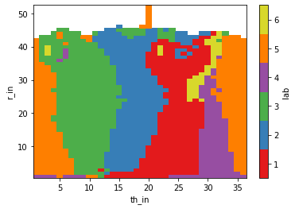
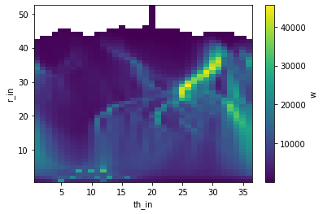
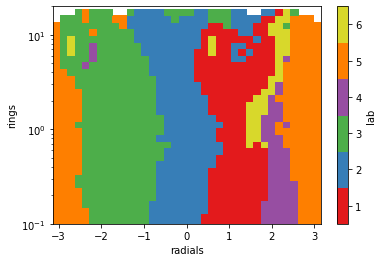
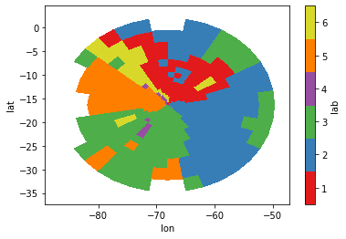

project name: hysplit_cluster_boundaries
created by diego aliaga daliaga_at_chacaltaya.edu.bo


```python
try: from useful_scit.imps import *
except: pass
import pandas as pd
import os
import sys
import xarray as xr
import matplotlib.pyplot as plt

try: import hysplit_cluster_boundaries.util as util
except: sys.path.extend(['../../'])
try: import hysplit_cluster_boundaries.util as util
except: raise ModuleNotFoundError('install hysplit_cluster_boundaries')


```


```python
source_path = '/Users/diego/hysplit_cluster_boundaries' \
              '/hysplit_cluster_boundaries'
data_path = os.path.join(source_path, 'data')

clus_name = 'cluster_simple_6_v01.csv'
radi_name = 'long_range_radials.csv'
ring_name = 'long_range_rings.csv'
```


```python
df_clus = pd.read_csv(os.path.join(data_path, clus_name))
df_radi = pd.read_csv(os.path.join(data_path, radi_name))
df_ring = pd.read_csv(os.path.join(data_path, ring_name))

df_clus = df_clus.sort_values(['th_in', 'r_in'])
df_clus = df_clus.set_index(['th_in', 'r_in'])
dfu = df_clus.unstack('th_in')['lab']
dfu.columns = df_radi['radials']
dfu.index = df_ring['rings']

da_clus = df_clus.to_xarray()
rad = da_clus['th_in']*0 + df_radi['radials']
rad.name = 'radials'
da_clus=da_clus.assign_coords(radials=rad)

ring = da_clus['r_in']*0 + df_ring['rings']
ring.name = 'rings'
da_clus=da_clus.assign_coords(rings=ring)

da_clus
```


    <xarray.Dataset>
    Dimensions:  (r_in: 52, th_in: 36)
    Coordinates:
      * th_in    (th_in) int64 1 2 3 4 5 6 7 8 9 10 ... 28 29 30 31 32 33 34 35 36
      * r_in     (r_in) int64 1 2 3 4 5 6 7 8 9 10 ... 43 44 45 46 47 48 49 50 51 52
        radials  (th_in) float64 -3.054 -2.88 -2.705 -2.531 ... 2.705 2.88 3.054
        rings    (r_in) float64 0.0 0.02 0.02349 0.02759 ... 38.43 45.14 53.02 62.27
    Data variables:
        lab      (th_in, r_in) float64 4.0 5.0 5.0 5.0 5.0 ... nan nan nan nan nan
        w        (th_in, r_in) float64 2.603e+03 6.806e+03 1.21e+04 ... nan nan nan


```python
da_clus['lab'].plot(x='th_in', y='r_in',
                    cmap=util.ccmap, vmin=.5, vmax=6.5)
plt.show()
```





```python
da_clus['w'].plot(x='th_in', y='r_in')
plt.show()
```





```python


```


```python
lat = util.r_th_to_lat(da_clus['rings'], da_clus['radials'])
lon = util.r_th_to_lon(da_clus['rings'], da_clus['radials'])

da_clus = da_clus.assign_coords(lat=lat)
da_clus = da_clus.assign_coords(lon=lon)
```


```python

```


```python
da_clus['lab'].plot(
    x='radials', y='rings',
    cmap=util.ccmap, vmin=.5, vmax=6.5,
    yscale='log', ylim=(.1, 20)
)
plt.show()
da_clus = da_clus.swap_dims({'r_in':'rings'})
da_clus = da_clus.loc[{'rings':slice(.05,20)}]
da_clus = da_clus.swap_dims({'rings':'r_in'})
```





```python
ll_range = 21
lo_min = util.CHC_LON - ll_range
lo_max = util.CHC_LON + ll_range
la_min = util.CHC_LAT - ll_range
la_max = util.CHC_LAT + ll_range

da_clus['lab'].plot(
    x='lon', y='lat',
    cmap=util.ccmap, vmin=.5, vmax=6.5,
    xlim=(lo_min, lo_max),
    ylim=(la_min, la_max),
)
plt.show()
```





```python
df_out = da_clus.to_dataframe()
```


```python
df_out
```


<div>
<style scoped>
    .dataframe tbody tr th:only-of-type {
        vertical-align: middle;
    }

    .dataframe tbody tr th {
        vertical-align: top;
    }

    .dataframe thead th {
        text-align: right;
    }
</style>
<table border="1" class="dataframe">
  <thead>
    <tr style="text-align: right;">
      <th></th>
      <th></th>
      <th>lab</th>
      <th>w</th>
      <th>radials</th>
      <th>rings</th>
      <th>lat</th>
      <th>lon</th>
    </tr>
    <tr>
      <th>r_in</th>
      <th>th_in</th>
      <th></th>
      <th></th>
      <th></th>
      <th></th>
      <th></th>
      <th></th>
    </tr>
  </thead>
  <tbody>
    <tr>
      <td rowspan="5" valign="top">8</td>
      <td>1</td>
      <td>5.0</td>
      <td>20135.5000</td>
      <td>-3.05433</td>
      <td>0.052508</td>
      <td>-16.355003</td>
      <td>-68.183643</td>
    </tr>
    <tr>
      <td>2</td>
      <td>5.0</td>
      <td>18317.8000</td>
      <td>-2.87979</td>
      <td>0.052508</td>
      <td>-16.364017</td>
      <td>-68.182053</td>
    </tr>
    <tr>
      <td>3</td>
      <td>5.0</td>
      <td>14839.3000</td>
      <td>-2.70526</td>
      <td>0.052508</td>
      <td>-16.372618</td>
      <td>-68.178923</td>
    </tr>
    <tr>
      <td>4</td>
      <td>5.0</td>
      <td>11900.1000</td>
      <td>-2.53073</td>
      <td>0.052508</td>
      <td>-16.380544</td>
      <td>-68.174347</td>
    </tr>
    <tr>
      <td>5</td>
      <td>5.0</td>
      <td>9655.5800</td>
      <td>-2.35619</td>
      <td>0.052508</td>
      <td>-16.387556</td>
      <td>-68.168463</td>
    </tr>
    <tr>
      <td>...</td>
      <td>...</td>
      <td>...</td>
      <td>...</td>
      <td>...</td>
      <td>...</td>
      <td>...</td>
      <td>...</td>
    </tr>
    <tr>
      <td rowspan="5" valign="top">44</td>
      <td>32</td>
      <td>6.0</td>
      <td>21.8331</td>
      <td>2.35619</td>
      <td>17.193700</td>
      <td>-4.192591</td>
      <td>-80.289062</td>
    </tr>
    <tr>
      <td>33</td>
      <td>3.0</td>
      <td>23.0000</td>
      <td>2.53073</td>
      <td>17.193700</td>
      <td>-6.488562</td>
      <td>-82.215615</td>
    </tr>
    <tr>
      <td>34</td>
      <td>NaN</td>
      <td>NaN</td>
      <td>2.70526</td>
      <td>17.193700</td>
      <td>-9.084050</td>
      <td>-83.714117</td>
    </tr>
    <tr>
      <td>35</td>
      <td>NaN</td>
      <td>NaN</td>
      <td>2.87979</td>
      <td>17.193700</td>
      <td>-11.900316</td>
      <td>-84.739159</td>
    </tr>
    <tr>
      <td>36</td>
      <td>NaN</td>
      <td>NaN</td>
      <td>3.05433</td>
      <td>17.193700</td>
      <td>-14.851963</td>
      <td>-85.259613</td>
    </tr>
  </tbody>
</table>
<p>1332 rows × 6 columns</p>
</div>


```python
data_out = os.path.join(source_path,'data_out')

da_clus.to_netcdf(os.path.join(data_out,'lab_weight_lat_lon_info.nc'))

labs_out = ['radials','rings','lat','lon','w','lab']
for l in labs_out:
    df_lab = df_out[l].unstack('th_in')
    df_lab.index.name = 'r|th'
    df_lab.to_csv(os.path.join(data_out,l+'.csv'))
```


```python

```


```python

```
